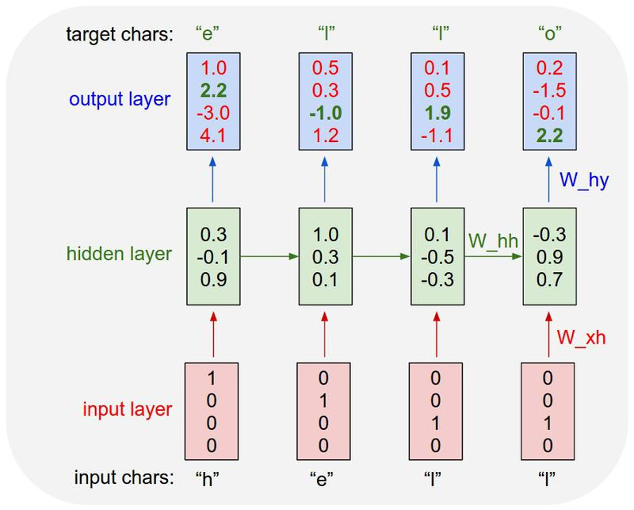

[Andrej Karpathy blog](http://karpathy.github.io/)의 [The Unreasonable Effectiveness of Recurrent Neural Networks](http://karpathy.github.io/2015/05/21/rnn-effectiveness/) 글에서 셰익스피어 희곡을 넣으면 희곡이, 컴퓨터 프로그램을 넣으면 프로그램이 비스무리하게 나오는 Recurrent Neural Networks를 소개했다. 올해에는 무려 [재즈를 넣으면 재즈가 나오고](http://keunwoochoi.blogspot.kr/2016/03/12-lstm-realbook.html) [메탈리카를 넣으면 메탈리카가 나오는](https://keunwoochoi.wordpress.com/2016/02/23/lstmetallica/) RNN이 등장했다.

가장 만만해 보이는 RNN이 문자 단위로 입력을 받아 문자 단위로 출력하는 [min-char-rnn](https://gist.github.com/karpathy/d4dee566867f8291f086)인데, 여기서부터 시작해서 차차 더 좋은 것을 만들어 보려고 한다.

<figure>
	
	<figcaption>min-char-rnn의 원리. 아래쪽에서 문자가 입력될 때 입력값은 W_xh로 변환되어 hidden layer에 들어가고, hidden layer에서는 들어온 값을 W_hy로 변환하여 다음 글자를 추론하여 출력한다. 각 단계마다 hidden layer는 자체적으로 W_hh로 변환되어 다음 글자를 받을 준비를 한다. 여기서는 [h, e, l, l]을 입력받아 각 입력에 대한 다음 글자인 [e, l, l, o]를 추론한다. 이미지 출처: <a href="http://karpathy.github.io/2015/05/21/rnn-effectiveness/" target="_blank">http://karpathy.github.io/2015/05/21/rnn-effectiveness/</a></figcaption>
</figure>

한글 소설을 넣으면 소설이 나오는 걸 만들어보고 싶은데, 한글은 글자 단위로 하면 네트워크가 많이 커지는 문제가 있어 음소 단위로 해보려고 한다. 아래와 같은 순서로 배우면 되겠다. 많네;;

1. **RNN 구현 배우기**
2. keras를 이용하여 gpu 가속 모델 작성
3. 네트워크를 LSTM으로 만들기
4. 원래 모델과 비교하여 성과가 좋은지 테스트
5. 한글 소설 수집
6. 한글을 음소 단위로 분리, 병합하는 모듈 작성
7. 만든 모델에 한글 음소 투입

첫번째로 기본적인 RNN모델을 먼저 공부해 봐야겠다. 데이터셋은 Andrej Karpathy가 github에 업로드한 [tinyshakespeare](https://github.com/karpathy/char-rnn/blob/master/data/tinyshakespeare/input.txt)를 사용하였다. 한글 주석이 포함된 전체 코드는 [github gist](https://gist.github.com/MinjeJeon/8f50693f0a986419ab2dda35753acb1f)에 업로드했다. 글을 쓰면서 계속 내용을 추가할 예정이다.

## 데이터 준비

```python
import numpy as np

# 데이터를 불러오고, 글자-벡터 간 상호 변환 매핑 준비 
data = open('input.txt', 'r').read() # 텍스트 파일 로드
chars = list(set(data)) # 텍스트 파일에서 고유한 문자 추출 
data_size, vocab_size = len(data), len(chars)
print('데이터는 {}개의 글자로 되어 있고, {}개의 고유한 문자가 있습니다.'.format(data_size, vocab_size))
print(repr(''.join(sorted(str(x) for x in chars)))) # 추출된 고유한 글자들을 알파벳 순서대로 출력

# 고유한 글자들(a,b,c,d...)을 숫자(1,2,3,4...)에 매핑하는 사전과, 반대 기능을 수행하는 사전을 만듦
char_to_ix = { ch:i for i,ch in enumerate(chars) }
ix_to_char = { i:ch for i,ch in enumerate(chars) }
```

데이터를 불러오고, 기본적인 처리를 위해 준비하는 과정이다. 출력은 아래와 같다.

```
데이터는 1115394글자로 되어 있고, 65개의 고유한 문자가 있습니다.
"\n !$&',-.3:;?ABCDEFGHIJKLMNOPQRSTUVWXYZabcdefghijklmnopqrstuvwxyz"
```

rnn의 학습은 데이터셋의 표현 이내로 제한되기 때문에, 학습된 모델은 영어와 띄어쓰기, 줄바꿈, 일부 기호를 사용할 수 있으나 3 이외의 숫자를 사용할 수는 없다.

## 변수 초기화

```python
# 하이퍼파라미터 설정
hidden_size = 100 # hidden state의 뉴런 갯수
seq_length = 25 # 학습시킬 때 한번에 불러올 글자 수이자 RNN을 펼쳤을 때의 단계 
learning_rate = 1e-1 # 학습속도, 가중치를 조정할 때 이동할 간격
```

하이퍼파라미터는 학습 모델에서 사람이 정해주는 변수라고 생각하면 된다. 이를 컴퓨터가 스스로 정하게 하기에는 너무 많은 시간이 걸리기 때문에 현재 하이퍼파라미터 설정은 인간의 감각과 경험에 크게 의존하고 있다.

```python
# 모델 파라미터 초기화(가중치는 작은 수의 랜덤한 값, bias는 0으로 초기화)
Wxh = np.random.randn(hidden_size, vocab_size)*0.01 # input to hidden (100,25)
Whh = np.random.randn(hidden_size, hidden_size)*0.01 # hidden to hidden (100,100)
Why = np.random.randn(vocab_size, hidden_size)*0.01 # hidden to output (25,100)
bh = np.zeros((hidden_size, 1)) # hidden bias (100,1)
by = np.zeros((vocab_size, 1)) # output bias (25,1)
```

일반적인 파라미터 초기화 코드이다. 파라미터(가중치, bias)들은 최적의 값을 찾는 과정에서 손실함수를 최소화하도록 조금씩 바뀐다.

#### 다음 글

* [min-char-rnn 한글 주해(2) - 메인 루프](2016-08-07-min-char-rnn-한글-주해-2)
* [min-char-rnn 한글 주해(3) - 손실값 계산, 그래디언트 계산, 문자 출력함수](#)