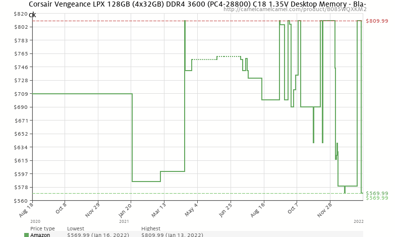
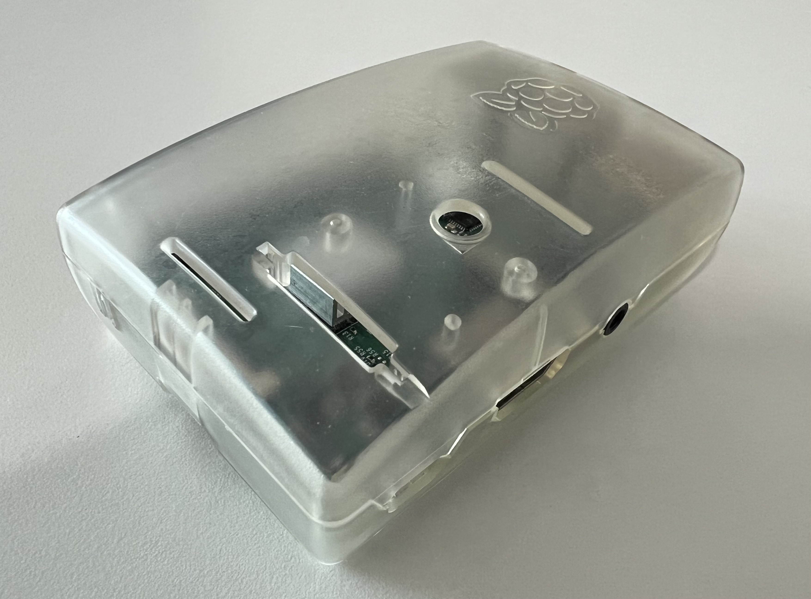
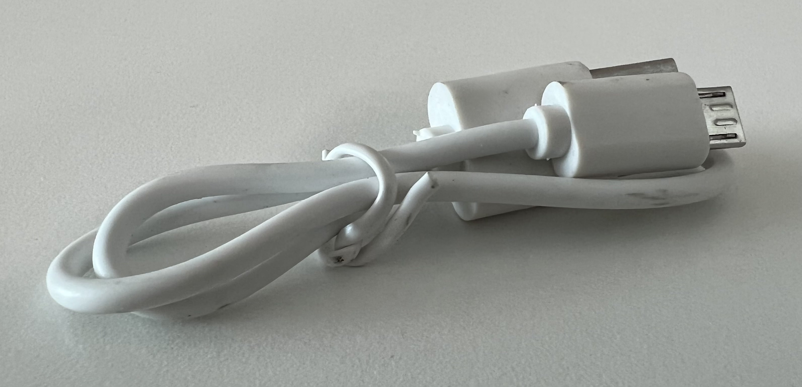
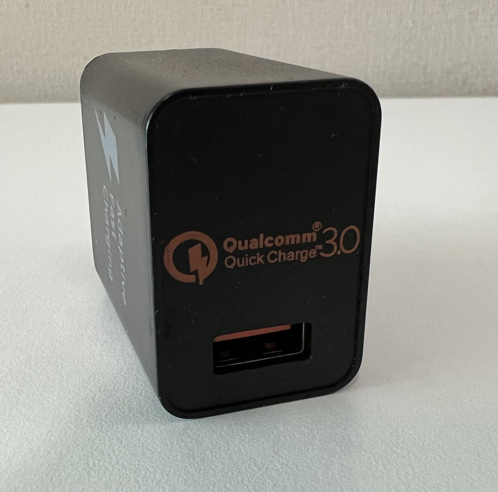
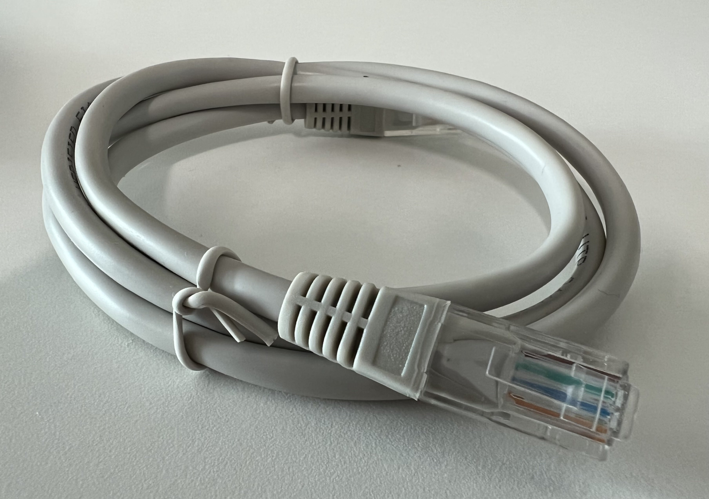
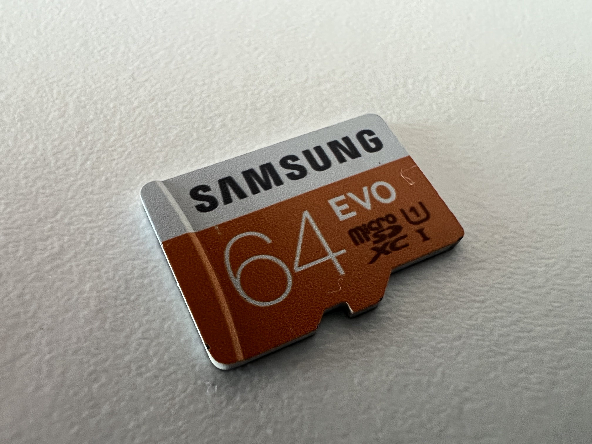
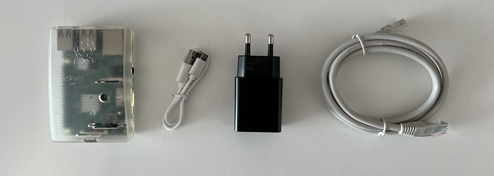
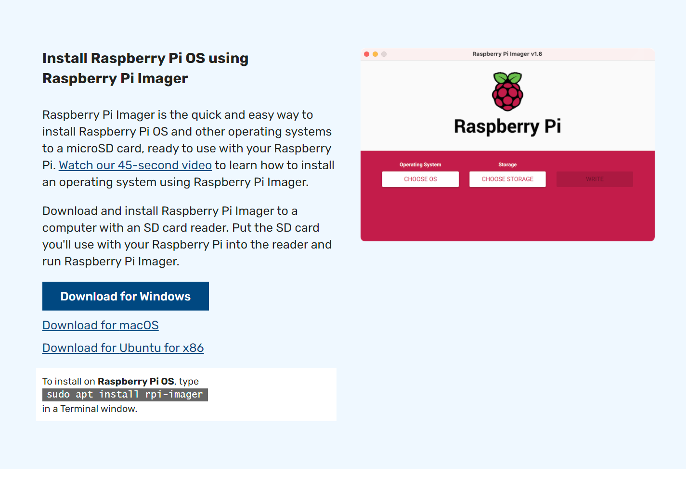

네이버의 부동산 매물 정보를 모니터링해서 시세 변화를 알아보려고 하는데 최저 매도호가를 [camelcamelcamel](https://camelcamelcamel.com/) 처럼 보여주는 사이트는 아직 없었다.

<figure style="max-width: 500px;">
  
</figure>

관심있는 단지가 적어서 손으로 해도 되지만, 왜인지 가슴이 시켜서 몇년전부터 잡동사니 상자에 처박혀있던 라즈베리 파이를 꺼냈다. 이걸 서버로 만들해서 시세를 모니터링하는 데 써보려고 한다.

## 하드웨어 준비

<figure style="max-width: 500px;">
  
  <figcaption>
    닦아도 안 지워지는 끈적한 무언가가 남아있었던 Raspberry Pi 3B
  </figcaption>
</figure>

<figure style="max-width: 500px;">
  
  <figcaption>집에서 굴러다니는 micro-b 케이블</figcaption>
</figure>

<figure style="max-width: 500px;">
  
  <figcaption>
    옛날 아이폰 충전기를 쓸까 하다가 특별히 권장 전력 2.5A를 맞춰주려고 꺼내
    놓은 충전기
  </figcaption>
</figure>

<figure style="max-width: 500px;">
  
  <figcaption>집에 박아놓고 한 번도 써보지 않은 케이블</figcaption>
</figure>

<figure style="max-width: 500px;">
  
  <figcaption>64gb Micro SD 카드</figcaption>
</figure>

<figure>
  
  <figcaption>모든 하드웨어 준비완료</figcaption>
</figure>

## 이미지 설치

https://www.raspberrypi.com/software/ 페이지에서 이미지를 다운로드 해서 Micro SD 카드에 설치한다. 옛날에는 프로그램을 따로 설치했었던 거 같은데, 요새는 전용 프로그램으로 SD카드 드라이브만 골라주면 바로 이미지 설치가 된다.

라즈베리 파이에 디스플레이나 USB 키보드를 연결할 생각는 전혀 없고 SSH만 이용할 건데, 아무 설정 없이 이미지를 만들면 SSH가 꺼져 있기 때문에 설정을 꼭 해줘야 한다.

Raspberry Pi Imager에 숨겨진 기능이 있는데, Ctrl-Shift-X를 누르면 Advanced Options 창이 뜨는데, 여기서 SSH, Hostname, pi 계정 비밀번호, 와이파이 등을 설정할 수가 있다. 아래 유튜브에 자세한 내용이 나와있다.

<iframe
  width="560"
  height="315"
  src="https://www.youtube.com/embed/om8gGB3gyT0"
  title="YouTube video player"
  frameborder="0"
  allow="accelerometer; autoplay; clipboard-write; encrypted-media; gyroscope; picture-in-picture"
  allowfullscreen
></iframe>
