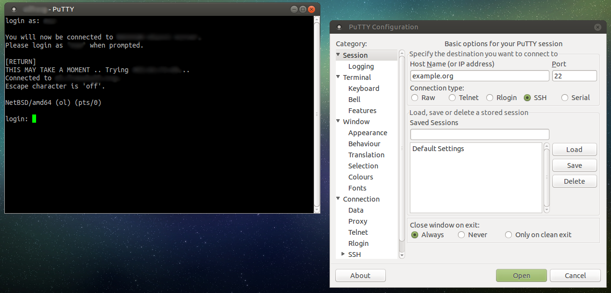
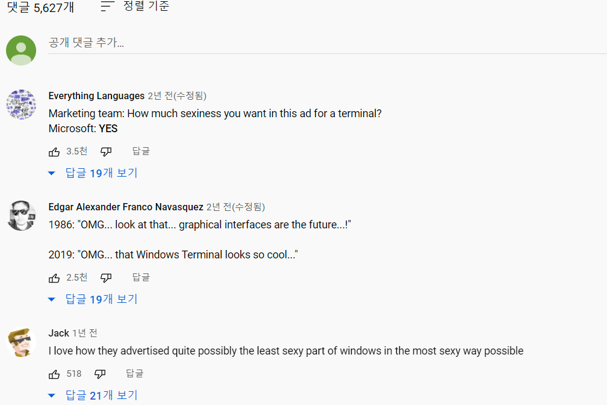
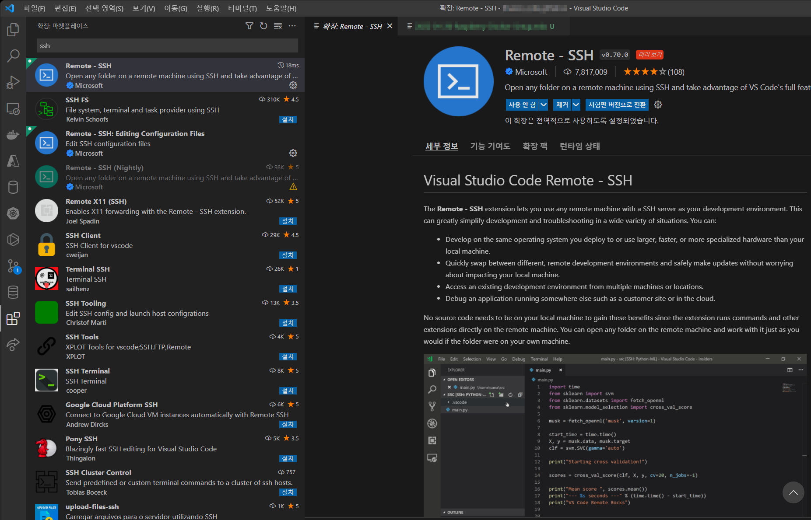
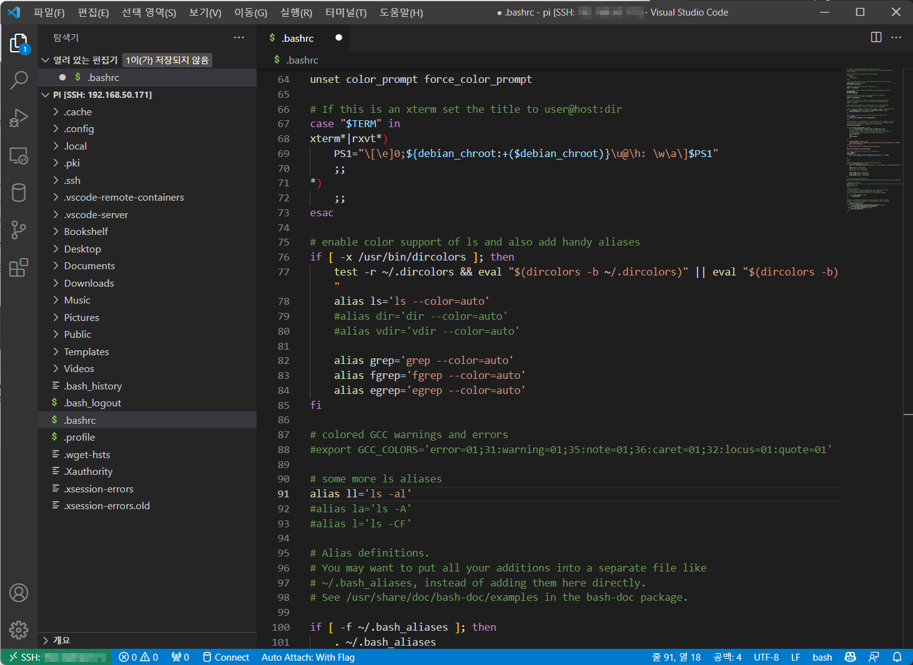
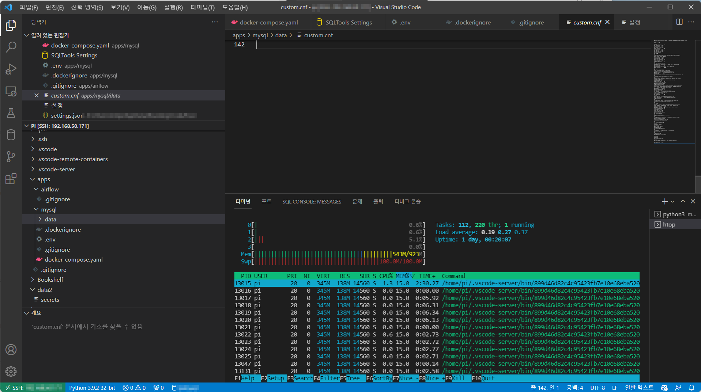

## VSCode로 SSH 접속하기

라즈베리 파이에 디스플레이나 키보드를 연결하지 않으면, 다른 기기에서 원격으로 접속을 해야 한다. 윈도우 사용자라면 보통 [PuTTY](https://www.putty.org/)를 많이 사용하는데, 이걸 쓰다보면 답답함이 밀려온다. 서버를 조작하거나 파일을 편집하려면 마우스도 제대로 못 쓰고 글씨만 있는 까만 화면을 보면서 작업을 해야 한다.

<figure>
  
  <figcaption>
    요즘도 많이 쓰는 PuTTY. 안 쓸 수는 없다😢
  </figcaption>
</figure>

터미널만 사용한다면 [Windows Terminal](https://www.microsoft.com/ko-kr/p/windows-terminal/9n0dx20hk701#activetab=pivot:overviewtab)를 사용하는 것도 좋다. SSH 접속을 프로필로 등록할 수 있어서, putty처럼 사용할 수 있다. 처음 나왔을 때 동영상이 좀 멋졌던 기억이 난다.

<iframe width="560" height="315" src="https://www.youtube.com/embed/8gw0rXPMMPE" title="YouTube video player" frameborder="0" allow="accelerometer; autoplay; clipboard-write; encrypted-media; gyroscope; picture-in-picture" allowfullscreen></iframe>

<figure>
  
  <figcaption>
    나만 이런거 좋아하는 건 아닌가보다
  </figcaption>
</figure>

[Visual Studio Code](https://code.visualstudio.com/)의 SSH 기능을 이용하면 **마치 로컬 폴더에서 작업하는 것처럼** IDE를 사용해서 편하게 편집도 하고, 파일도 탐색기로 업로드/다운로드가 가능하다. Remote-SSH 플러그인을 설치하면 왼쪽 바에 원격 데스크탑 버튼과 비슷하게 생긴 원격 탐색기 버튼이 나타난다.



Raspberry Pi에 접속해 보니 `ll` alias가 등록되지 않아서 `~/.bashrc`파일을 편집해 보았다. 



이렇게 할 수 있는 건, 원격 서버에 vscode의 서버 파트를 설치하여 UI는 로컬에서, 동작은 서버에서 이루어지도록 구성되었기 때문이다. vscode가 단순 텍스트 에디터보다는 자원을 많이 소모하는 편이라서 서버 파트만 해도 Raspberry Pi 3의 1GB 램 중 140MB정도를 사용해서 부담이 되기는 한다.

<figure>
  
  <figcaption>
    Remote Development using SSH <a href="https://code.visualstudio.com/docs/remote/ssh">https://code.visualstudio.com/docs/remote/ssh</a>
  </figcaption>
</figure>



## 도커 설치

https://dev.to/elalemanyo/how-to-install-docker-and-docker-compose-on-raspberry-pi-1mo 에서 소개한 방법으로 하면 쉽게 설치 가능하다.

```bash
# 설치 전 패키지 업데이트
sudo apt update && sudo apt upgrade -y 

# 도커 설치 스크립트 다운로드 및 설치
curl -sSL https://get.docker.com | sudo sh 

# 도커 서비스를 켜질 때마다 자동으로 실행
sudo systemctl enable docker

# 사용자에게 도커 그룹을 추가, sudo docker 말고 docker로 컨테이너 관리
# 해당 커맨드는 bash로 다시 접속할 때부터 적용
sudo usermod -aG docker ${USER} 
```


### docker-compose 설치

https://docs.docker.com/compose/install/ 에서 권장하는 방법은 아래와 같지만, 바이너리가 없어서 그런지 Raspberry Pi에서는 작동하지 않는다.

```bash
sudo curl -L "https://github.com/docker/compose/releases/download/v1.29.2/docker-compose-$(uname -s)-$(uname -m)" -o /usr/local/bin/docker-compose
sudo chmod +x /usr/local/bin/docker-compose
```

python3을 설치 후에 pip로 docker-compose를 설치하면 잘 작동한다.

```bash
sudo apt install -y libffi-dev libssl-dev python3-dev python3 python3-pip
sudo pip3 install docker-compose
```


